# Modelo entidade-relacionamento

Diagrama completo (dimensoes + fatos + pontes) do Data Warehouse do Polo
Inovale. Cardinalidades simplificadas para legibilidade.

```mermaid
erDiagram
    dim_tempo ||--o{ fato_investimento_inovacao : "id_tempo"
    dim_tempo ||--o{ fato_adocao_tecnologica : "id_tempo"
    dim_tempo ||--o{ fato_desempenho_organizacao : "id_tempo"
    dim_tempo ||--o{ fato_talento : "id_tempo"

    dim_municipio ||--o{ dim_organizacao : "id_municipio"

    dim_setor ||--o{ dim_organizacao : "id_setor"
    dim_setor ||--o{ dim_projeto : "id_setor"

    dim_organizacao ||--o{ fato_investimento_inovacao : "id_organizacao"
    dim_organizacao ||--o{ fato_inovacao : "id_organizacao"
    dim_organizacao ||--o{ fato_adocao_tecnologica : "id_organizacao"
    dim_organizacao ||--o{ fato_desempenho_organizacao : "id_organizacao"
    dim_organizacao ||--o{ fato_talento : "id_organizacao"
    dim_organizacao ||--o{ fato_propriedade_intelectual : "id_organizacao"
    dim_organizacao ||--o{ dim_projeto : "id_organizacao_lider"
    dim_organizacao ||--o{ fato_conexao_ecossistema : "id_organizacao_origem"
    dim_organizacao ||--o{ fato_conexao_ecossistema : "id_organizacao_destino"
    dim_organizacao ||--o| contato_organizacao : "id_organizacao (PII, isolado)"

    dim_fonte_recurso ||--o{ fato_investimento_inovacao : "id_fonte_recurso"
    dim_fonte_recurso ||--o{ dim_projeto : "id_fonte_principal"

    dim_projeto ||--o{ fato_inovacao : "id_projeto (opcional)"
    dim_projeto ||--o{ fato_conexao_ecossistema : "id_projeto (opcional)"
    dim_projeto ||--o{ fato_propriedade_intelectual : "id_projeto (opcional)"
    dim_projeto ||--o{ fato_investimento_inovacao : "id_projeto (opcional)"
    dim_tecnologia ||--o{ dim_projeto : "id_tecnologia_principal"
    dim_problema_alvo ||--o{ dim_projeto : "id_problema_alvo"

    dim_tipo_inovacao ||--o{ fato_inovacao : "id_tipo_inovacao"
    dim_grau_novidade ||--o{ fato_inovacao : "id_grau_novidade"
    dim_problema_alvo ||--o{ fato_inovacao : "id_problema_alvo"

    fato_inovacao ||--o{ bridge_inovacao_tecnologia : "id_inovacao"
    dim_tecnologia ||--o{ bridge_inovacao_tecnologia : "id_tecnologia"

    dim_tecnologia ||--o{ fato_adocao_tecnologica : "id_tecnologia"

    dim_projeto ||--o{ bridge_projeto_organizacao : "id_projeto"
    dim_organizacao ||--o{ bridge_projeto_organizacao : "id_organizacao"
    dim_projeto ||--o{ bridge_projeto_tecnologia : "id_projeto"
    dim_tecnologia ||--o{ bridge_projeto_tecnologia : "id_tecnologia"

    ciclo_coleta ||--o{ universo_pesquisado : "id_ciclo"
    ciclo_coleta ||--o{ fato_adocao_tecnologica : "id_ciclo"
    ciclo_coleta ||--o{ cobertura_coleta : "id_ciclo (via universo_pesquisado)"
    dim_organizacao ||--o{ universo_pesquisado : "id_organizacao"
    universo_pesquisado ||--o| cobertura_coleta : "(id_ciclo, id_organizacao) FK composta"

    dim_tempo {
        bigint id_tempo PK
        date data
        int dia
        int mes
        text nome_mes
        int trimestre
        int ano
    }

    dim_municipio {
        bigint id_municipio PK
        text codigo_ibge
        text nome
        text uf
        text regiao
        bool pertence_area_atuacao
    }

    dim_organizacao {
        bigint id_organizacao PK
        text nome
        text nome_fantasia
        text cnpj
        text tipo_organizacao
        bigint id_municipio FK
        bigint id_setor FK
        text porte
        int ano_fundacao
        text site
        bool ativa
        date data_entrada_ecossistema
        date data_saida_ecossistema
        text motivo_saida
    }

    contato_organizacao {
        bigint id_contato PK
        bigint id_organizacao FK
        text nome_contato
        text email
        text telefone
        text cargo
    }

    dim_setor {
        bigint id_setor PK
        text nome
        text codigo
    }

    dim_tecnologia {
        bigint id_tecnologia PK
        text nome
        text codigo
    }

    dim_tipo_inovacao {
        bigint id_tipo_inovacao PK
        text nome
    }

    dim_grau_novidade {
        bigint id_grau_novidade PK
        int ordem
        text nome
    }

    dim_fonte_recurso {
        bigint id_fonte_recurso PK
        text nome
    }

    dim_problema_alvo {
        bigint id_problema_alvo PK
        text nome
    }

    dim_projeto {
        bigint id_projeto PK
        text nome
        bigint id_organizacao_lider FK
        text status
        numeric valor_total
        bigint id_fonte_principal FK
        bigint id_setor FK
        bigint id_tecnologia_principal FK
        bigint id_problema_alvo FK
        bool sustentabilidade
        bool automacao
        text impacto_trabalho
    }

    fato_investimento_inovacao {
        bigint id_fato PK
        bigint id_organizacao FK
        bigint id_tempo FK
        bigint id_fonte_recurso FK
        bigint id_projeto FK
        text categoria
        numeric valor
    }

    fato_inovacao {
        bigint id_inovacao PK
        bigint id_organizacao FK
        bigint id_projeto FK
        text nome
        bigint id_tipo_inovacao FK
        bigint id_grau_novidade FK
        bigint id_problema_alvo FK
        text status
        bool chegou_ao_mercado
        text impacto_trabalho
        numeric receita_associada
        int empregos_criados
    }

    bridge_inovacao_tecnologia {
        bigint id_inovacao FK
        bigint id_tecnologia FK
        bool principal
    }

    bridge_projeto_organizacao {
        bigint id_projeto FK
        bigint id_organizacao FK
        text papel
        date data_entrada
        date data_saida
    }

    bridge_projeto_tecnologia {
        bigint id_projeto FK
        bigint id_tecnologia FK
        bool principal
    }

    ciclo_coleta {
        bigint id_ciclo PK
        text nome
        smallint ano_referencia
        text tipo_cobertura
    }

    universo_pesquisado {
        bigint id_ciclo FK
        bigint id_organizacao FK
        bool elegivel
        text motivo_inelegibilidade
    }

    cobertura_coleta {
        bigint id_ciclo FK
        bigint id_organizacao FK
        bool respondeu
        date data_resposta
        text instrumento
    }

    fato_conexao_ecossistema {
        bigint id_conexao PK
        bigint id_organizacao_origem FK
        bigint id_organizacao_destino FK
        text tipo_conexao
        bigint id_projeto FK
        bool gerou_projeto
        bool gerou_contrato
        bool gerou_inovacao
    }

    fato_adocao_tecnologica {
        bigint id_fato PK
        bigint id_organizacao FK
        bigint id_tecnologia FK
        bigint id_tempo FK
        bigint id_ciclo FK
        smallint nivel_adocao
    }

    fato_desempenho_organizacao {
        bigint id_fato PK
        bigint id_organizacao FK
        bigint id_tempo FK
        numeric faturamento
        int numero_empregados
        numeric investimento_p_d
    }

    fato_talento {
        bigint id_fato PK
        bigint id_organizacao FK
        bigint id_tempo FK
        int pesquisadores_p_d
        int doutores
    }

    fato_propriedade_intelectual {
        bigint id_pi PK
        bigint id_organizacao FK
        bigint id_projeto FK
        text tipo_pi
        text status
    }
```

## Decisões de modelagem que se afastam do texto literal do briefing

1. **`setor_economico`, `tecnologia_principal`, `organizacao_lider`, `fonte_principal`,
   `organizacao_origem/destino` viraram foreign keys** (`id_setor`,
   `id_tecnologia_principal`, `id_organizacao_lider`, `id_fonte_principal`,
   `id_organizacao_origem/destino`) em vez de texto livre — necessario para os
   KPIs de investimento por setor/tecnologia e para a analise de rede.
2. **`fato_investimento_inovacao` ganhou `id_projeto` (nullable)**, ausente na
   lista de campos original — sem isso nao e possivel calcular
   `vw_investimento_por_tecnologia` (a tecnologia e atributo do projeto, nao
   do investimento).
3. **`core.contato_organizacao` foi criada** para isolar dados pessoais (LGPD)
   que apareceriam naturalmente em um cadastro de organizacoes (nome de
   contato, e-mail, telefone). Nao faz parte do schema `mart` nem da role
   `powerbi_readonly`.
4. **`sustentabilidade` e `automacao`** (secao 6 do briefing) foram
   implementados como booleanos simples em `core.projeto`, por falta de
   definicao de dominio mais rica no requisito original.
5. **Universo pesquisado e cobertura de coleta** (`core.ciclo_coleta`,
   `core.universo_pesquisado`, `core.cobertura_coleta`) foram adicionados
   para resolver uma ambiguidade estrutural: ausencia de dado nao significa
   "zero". Distinguem organizacao fora do escopo pesquisado, organizacao
   no escopo mas nao-respondente, e organizacao respondente que declarou
   explicitamente nao usar uma tecnologia (`fato_adocao_tecnologica.nivel_adocao = 0`).
   `mart.vw_respondentes_elegiveis` e a base do denominador de
   `vw_taxa_empresas_inovadoras`, `vw_taxa_primeira_inovacao` e
   `vw_adocao_tecnologia` — substituindo o uso anterior de "todas as
   organizacoes ativas" ou de `fato_desempenho_organizacao` como proxy.
6. **`fato_investimento_inovacao.id_projeto` mudou de `UNIQUE` simples para
   `UNIQUE NULLS NOT DISTINCT`** (PostgreSQL 16+): como o projeto e opcional,
   duas linhas com o mesmo grao e ambas sem projeto vinculado sao a mesma
   medida e devem colidir — com `UNIQUE` padrao, o Postgres trata `NULL <>
   NULL` e permitiria duplicatas silenciosas.
7. **`bridge_projeto_organizacao` e `bridge_projeto_tecnologia`** foram
   adicionadas para representar projetos com multiplos participantes
   (papeis funcionais: `lider`, `parceiro`, `executor`, `financiador`,
   `fornecedor`, `beneficiario`, `outro` — **nao** `universidade`/`ict`,
   que sao tipos de organizacao, nao papeis de projeto; o tipo vem de
   `dim_organizacao.tipo_organizacao` via join) e multiplas tecnologias.
   `core.projeto.id_organizacao_lider`/`id_tecnologia_principal`
   continuam sendo os campos denormalizados usados pelas views, mas agora
   sao a **fonte de verdade enforced por trigger**, nao apenas uma
   convencao documentada: `core.fn_projeto_sync_bridge_lider()` e
   `core.fn_projeto_sync_bridge_tecnologia_principal()` propagam
   automaticamente qualquer INSERT/UPDATE de `core.projeto` para a
   bridge; `core.fn_guard_bridge_projeto_lider()` e
   `core.fn_guard_bridge_projeto_tecnologia_principal()` rejeitam
   (`RAISE EXCEPTION`) qualquer INSERT/UPDATE/DELETE feito diretamente na
   bridge que divirja do valor atual em `core.projeto`. Excluir o projeto
   inteiro continua funcionando normalmente (a cascata do `DELETE`
   acontece antes de o guard ter uma linha de `core.projeto` para
   comparar). Ver `db/schemas/23_core_bridges.sql` e
   `tests/db/test_bridge_projeto.py`.
8. **Fonte de verdade para investimento em P&D documentada explicitamente**
   (comentarios SQL em `core.fato_desempenho_organizacao.investimento_p_d` e
   `core.fato_investimento_inovacao.categoria`): o KPI de intensidade de
   P&D usa o valor autodeclarado em `fato_desempenho_organizacao` (mesmo
   grao do faturamento); o detalhamento por fonte/projeto/tecnologia usa a
   soma categorizada em `fato_investimento_inovacao`. As duas nunca devem
   ser somadas entre si — `mart.vw_conciliacao_investimento_pd` existe para
   investigar divergencias entre elas.
9. **`id_origem_externa` (nullable) + indice unico parcial** adicionados em
   `fato_inovacao`, `fato_conexao_ecossistema` e `fato_propriedade_intelectual`
   — as unicas tabelas fato sem nenhuma chave natural de grao — para
   permitir upsert idempotente (`INSERT ... ON CONFLICT (id_origem_externa)
   DO UPDATE`) em reprocessamentos futuros. As demais tabelas fato ja tinham
   uma `UNIQUE` de grao natural (organizacao+periodo+...) que cumpre esse
   papel.
10. **`core.dim_organizacao` ganhou `data_saida_ecossistema` e
    `motivo_saida`**, complementando `data_entrada_ecossistema` — base
    minima para `mart.vw_cohort_sobrevivencia_empresarial`, a estrutura
    preparada (mas ainda nao uma curva de sobrevivencia completa) para
    medir renovacao empresarial e sobrevivencia por coorte.
11. **`mart.vw_adocao_tecnologia` particiona o "estado mais recente" por
    `id_ciclo + id_organizacao + id_tecnologia`**, nao apenas
    `id_organizacao + id_tecnologia`. A versao anterior usava `DISTINCT ON
    (id_organizacao, id_tecnologia)` ordenado por `id_tempo DESC`, o que
    colapsava todos os ciclos em um so — mantendo visivel apenas a medicao
    mais recente e escondendo ciclos anteriores da serie historica. Ver
    `tests/mart/test_adocao_tecnologica.py`.
12. **`core.cobertura_coleta` referencia `core.universo_pesquisado` por FK
    composta `(id_ciclo, id_organizacao)`** em vez de duas FKs simples
    (`id_ciclo` -> `ciclo_coleta`, `id_organizacao` -> `dim_organizacao`).
    Isso torna estruturalmente impossivel registrar cobertura de uma
    organizacao que nunca entrou no universo pesquisado daquele ciclo —
    antes disso era apenas uma expectativa de uso, nao uma garantia do
    banco.
