# Modelo entidade-relacionamento

Diagrama completo (dimensoes + fatos + pontes) do Data Warehouse do Polo
Inovale. Cardinalidades simplificadas para legibilidade.

```mermaid
erDiagram
    dim_tempo ||--o{ fato_investimento_inovacao : "id_tempo"
    dim_tempo ||--o{ fato_adocao_tecnologica : "id_tempo"
    dim_tempo ||--o{ fato_desempenho_organizacao : "id_tempo"
    dim_tempo ||--o{ fato_talento : "id_tempo"

    dim_municipio ||--o{ dim_organizacao : "id_municipio"

    dim_setor ||--o{ dim_organizacao : "id_setor"
    dim_setor ||--o{ dim_projeto : "id_setor"

    dim_organizacao ||--o{ fato_investimento_inovacao : "id_organizacao"
    dim_organizacao ||--o{ fato_inovacao : "id_organizacao"
    dim_organizacao ||--o{ fato_adocao_tecnologica : "id_organizacao"
    dim_organizacao ||--o{ fato_desempenho_organizacao : "id_organizacao"
    dim_organizacao ||--o{ fato_talento : "id_organizacao"
    dim_organizacao ||--o{ fato_propriedade_intelectual : "id_organizacao"
    dim_organizacao ||--o{ dim_projeto : "id_organizacao_lider"
    dim_organizacao ||--o{ fato_conexao_ecossistema : "id_organizacao_origem"
    dim_organizacao ||--o{ fato_conexao_ecossistema : "id_organizacao_destino"
    dim_organizacao ||--o| contato_organizacao : "id_organizacao (PII, isolado)"

    dim_fonte_recurso ||--o{ fato_investimento_inovacao : "id_fonte_recurso"
    dim_fonte_recurso ||--o{ dim_projeto : "id_fonte_principal"

    dim_projeto ||--o{ fato_inovacao : "id_projeto (opcional)"
    dim_projeto ||--o{ fato_conexao_ecossistema : "id_projeto (opcional)"
    dim_projeto ||--o{ fato_propriedade_intelectual : "id_projeto (opcional)"
    dim_projeto ||--o{ fato_investimento_inovacao : "id_projeto (opcional)"
    dim_tecnologia ||--o{ dim_projeto : "id_tecnologia_principal"
    dim_problema_alvo ||--o{ dim_projeto : "id_problema_alvo"

    dim_tipo_inovacao ||--o{ fato_inovacao : "id_tipo_inovacao"
    dim_grau_novidade ||--o{ fato_inovacao : "id_grau_novidade"
    dim_problema_alvo ||--o{ fato_inovacao : "id_problema_alvo"

    fato_inovacao ||--o{ bridge_inovacao_tecnologia : "id_inovacao"
    dim_tecnologia ||--o{ bridge_inovacao_tecnologia : "id_tecnologia"

    dim_tecnologia ||--o{ fato_adocao_tecnologica : "id_tecnologia"

    dim_tempo {
        bigint id_tempo PK
        date data
        int dia
        int mes
        text nome_mes
        int trimestre
        int ano
    }

    dim_municipio {
        bigint id_municipio PK
        text codigo_ibge
        text nome
        text uf
        text regiao
        bool pertence_area_atuacao
    }

    dim_organizacao {
        bigint id_organizacao PK
        text nome
        text nome_fantasia
        text cnpj
        text tipo_organizacao
        bigint id_municipio FK
        bigint id_setor FK
        text porte
        int ano_fundacao
        text site
        bool ativa
        date data_entrada_ecossistema
    }

    contato_organizacao {
        bigint id_contato PK
        bigint id_organizacao FK
        text nome_contato
        text email
        text telefone
        text cargo
    }

    dim_setor {
        bigint id_setor PK
        text nome
        text codigo
    }

    dim_tecnologia {
        bigint id_tecnologia PK
        text nome
        text codigo
    }

    dim_tipo_inovacao {
        bigint id_tipo_inovacao PK
        text nome
    }

    dim_grau_novidade {
        bigint id_grau_novidade PK
        int ordem
        text nome
    }

    dim_fonte_recurso {
        bigint id_fonte_recurso PK
        text nome
    }

    dim_problema_alvo {
        bigint id_problema_alvo PK
        text nome
    }

    dim_projeto {
        bigint id_projeto PK
        text nome
        bigint id_organizacao_lider FK
        text status
        numeric valor_total
        bigint id_fonte_principal FK
        bigint id_setor FK
        bigint id_tecnologia_principal FK
        bigint id_problema_alvo FK
        bool sustentabilidade
        bool automacao
        text impacto_trabalho
    }

    fato_investimento_inovacao {
        bigint id_fato PK
        bigint id_organizacao FK
        bigint id_tempo FK
        bigint id_fonte_recurso FK
        bigint id_projeto FK
        text categoria
        numeric valor
    }

    fato_inovacao {
        bigint id_inovacao PK
        bigint id_organizacao FK
        bigint id_projeto FK
        text nome
        bigint id_tipo_inovacao FK
        bigint id_grau_novidade FK
        bigint id_problema_alvo FK
        text status
        bool chegou_ao_mercado
        text impacto_trabalho
        numeric receita_associada
        int empregos_criados
    }

    bridge_inovacao_tecnologia {
        bigint id_inovacao FK
        bigint id_tecnologia FK
        bool principal
    }

    fato_conexao_ecossistema {
        bigint id_conexao PK
        bigint id_organizacao_origem FK
        bigint id_organizacao_destino FK
        text tipo_conexao
        bigint id_projeto FK
        bool gerou_projeto
        bool gerou_contrato
        bool gerou_inovacao
    }

    fato_adocao_tecnologica {
        bigint id_fato PK
        bigint id_organizacao FK
        bigint id_tecnologia FK
        bigint id_tempo FK
        smallint nivel_adocao
    }

    fato_desempenho_organizacao {
        bigint id_fato PK
        bigint id_organizacao FK
        bigint id_tempo FK
        numeric faturamento
        int numero_empregados
        numeric investimento_p_d
    }

    fato_talento {
        bigint id_fato PK
        bigint id_organizacao FK
        bigint id_tempo FK
        int pesquisadores_p_d
        int doutores
    }

    fato_propriedade_intelectual {
        bigint id_pi PK
        bigint id_organizacao FK
        bigint id_projeto FK
        text tipo_pi
        text status
    }
```

## Decisões de modelagem que se afastam do texto literal do briefing

1. **`setor_economico`, `tecnologia_principal`, `organizacao_lider`, `fonte_principal`,
   `organizacao_origem/destino` viraram foreign keys** (`id_setor`,
   `id_tecnologia_principal`, `id_organizacao_lider`, `id_fonte_principal`,
   `id_organizacao_origem/destino`) em vez de texto livre — necessario para os
   KPIs de investimento por setor/tecnologia e para a analise de rede.
2. **`fato_investimento_inovacao` ganhou `id_projeto` (nullable)**, ausente na
   lista de campos original — sem isso nao e possivel calcular
   `vw_investimento_por_tecnologia` (a tecnologia e atributo do projeto, nao
   do investimento).
3. **`core.contato_organizacao` foi criada** para isolar dados pessoais (LGPD)
   que apareceriam naturalmente em um cadastro de organizacoes (nome de
   contato, e-mail, telefone). Nao faz parte do schema `mart` nem da role
   `powerbi_readonly`.
4. **`sustentabilidade` e `automacao`** (secao 6 do briefing) foram
   implementados como booleanos simples em `core.projeto`, por falta de
   definicao de dominio mais rica no requisito original.
